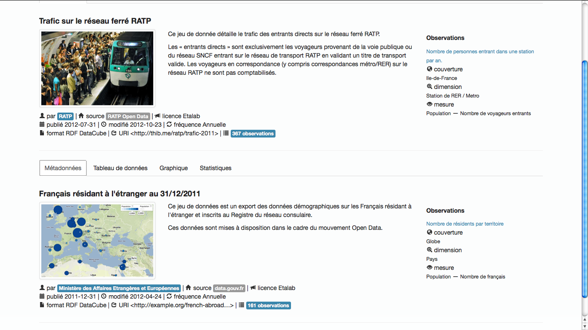
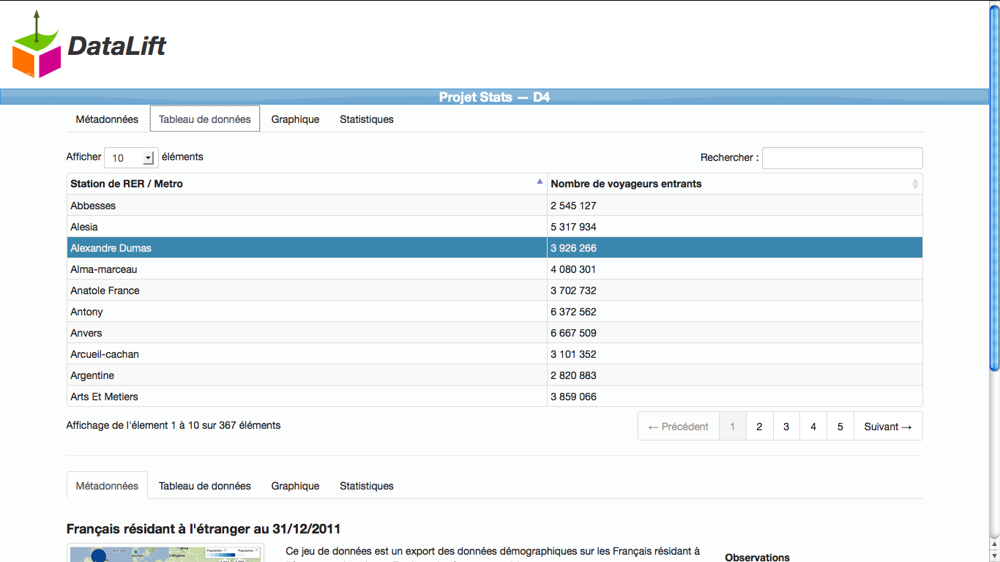
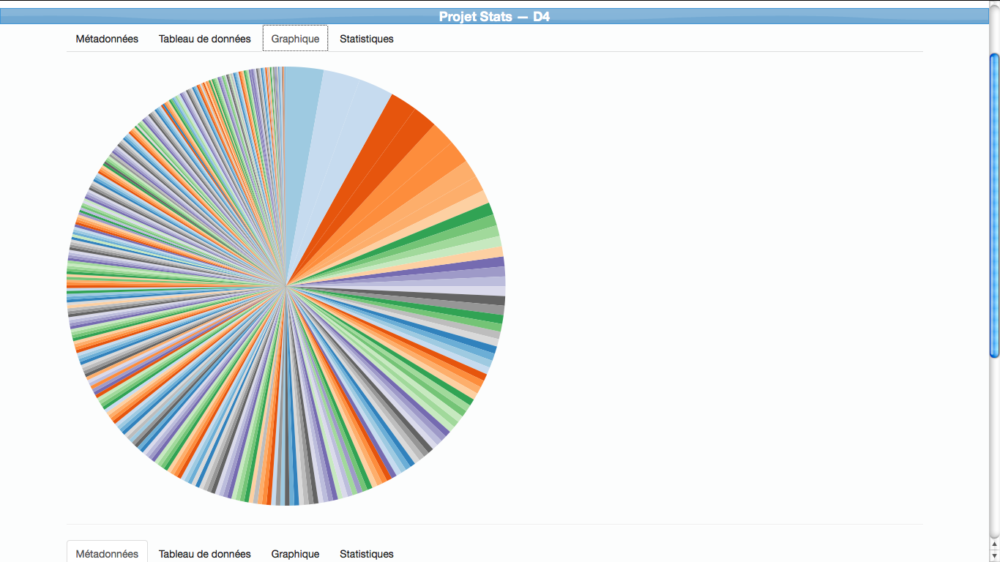
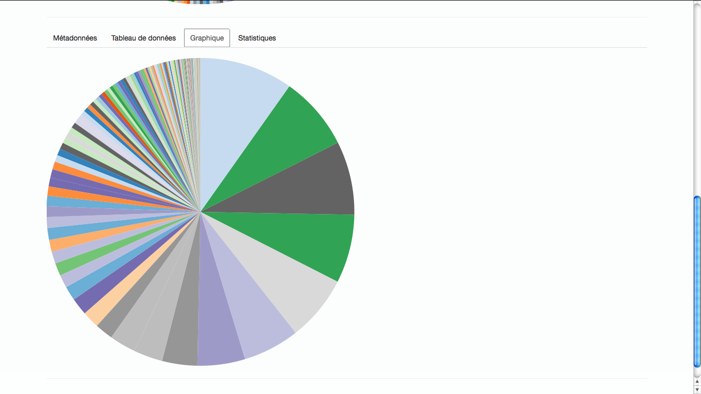
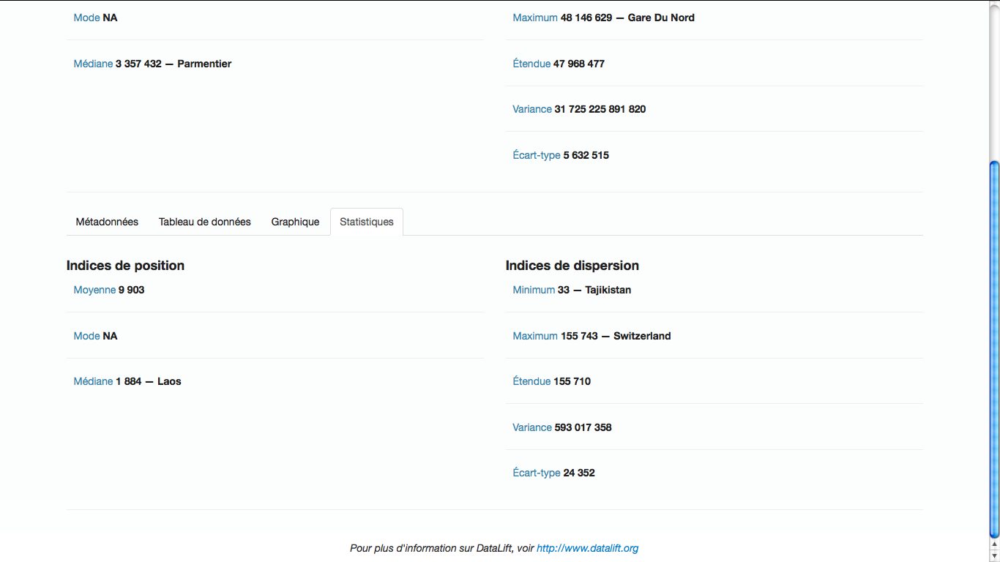

# D4

> DataLift, DataCube, D3

## tl;dr

> D4 is a DataLift module to visualize RDF DataCube data.
>
> D4 is made with Twitter Bootstrap, D3.js, Underscore and CoffeeScript.

## Functionalities

### Metadata visualization

D4's main interface displays the datasets' metadata : a previsouly defined set of metadata properties are retrieved via SPARQL and displayed according to a predefined scheme. Each property is translated to the user's language if available and so does the interface.

We believe metadata availability is especially important in the case of statistical datasets to identify the data's origin and data retrieval methodology.

D4 uses the Underscore.js library to format its String and number values according to the user's language.

### Data Table view

A classic table displays all of the observations in a spreadsheet-like style. Rows can be ordered according to their cells' values, the user can search for values in the data, thus being able to see each data item individually if necessary.

This view is necessary to be able to look for the greatest / lowest values and to be able to visualize every piece of data in a format that every user will know how to use.

D4 uses the DataTables jQuery plugin to manage its table.

### Graph view

Here, (at the moment) we display a pie chart ("camembert") which the summarizes all of the dataset's view. This rather simple graph has one main advantage : first, it is easily comprehensible by anyone looking at it, because you can understand the data distribution (size, patterns, outliers) really quickly. It is however also limited in a number of ways and has to be taken much more as a proof of concept rather than a polished result.

This really is one of the most important part of data visualisation : the ability to overview big data in small representations, to understand how the data is distributed without having to look at all the data items.

D4 uses the D3.js library which creates graphs via SVG to display its pie chart.

### Statistic measures

Here are displayed the most used statistic dispersion and position measures : the mean, the mode, the median, the variance, the standard deviation, the range, minimum and maximum values. Those measures aren't always available for all of the datasets, nor useful for some of them, but can be easily understood by beginner statisticians.

Being able to create knowledge by processing data is amazing, and the modern deluge of information makes this automatic processing a necessity. Our module doesn't go as far as could be but this view is a statement that this kind of processing is needed for a good visualisation / data analysis tool.

D4's statistical values are calculated using custom functions written in CoffeeScript, of course with well known formulas.

## Example datasets

### RATP 2011 trafic

This dataset is from the new (as of november 2012) http://data.ratp.fr/ data portal. It contains the number of travelers entering each of RATP's 367 RER and metro stations during 2011.

It is available on the RATP data portal as a CSV with metadata in an joint PDF file. It has been converted to DataCube RDF using Google Refine and DataLift.

### French diaspora

This dataset is from the French Open Data portal (http://data.gouv.fr/). It counts the number of french people living in each of the world's countries.

It is available as a CSV file and has been converted to DataCube RDF with Google Refine, Datalift, and then interlinked to DBpedia's countries using StringToURI.

Before being used here, this dataset has been converted to Google's DSPL in order to try out this format's capabilities and Google's Public Data Explorer (https://www.google.com/publicdata/directory).
The data has been put on a map where the number of french people in each country is displayed as a blue circle, the bigger the circle the more french people.

## Module architecture

### General workflow

### Back-end

D4 is backed by DataLift, thus made with JEE, Jersey, Empire and a Sesame triple store. D4 retrieves the datasets' data via SPARQL , uses a little ORM-like translation and sends DataCube DataSets to its views which use Velocity.

### Front-end

Data is included with Velocity and rendered on an HTML template written with Twitter Bootstrap. Graphs are made of SVG generated by D3.js, and the whole JavaScript code actually is compiled CoffeeScript.

## Installation

You'll need DataLift's source code.

- Put the d4 module directory inside of datalift's module source directory.
- Add d4 to the list of modules in the main build.xml file.
- ant dist
- Put the resulting modules into DataLift's module directory.

## Development

An alternative live-build.xml file is provided to fasten the development process. It is also worth pointing out that it is better to modify the .coffee files and recompile them with coffee -c rather than modify the JavaScript.

### Further improvements

+ Handle much more dataset types
++ There is a good example of interesting data to handle in the doc/ folder.
+ Correct the variance's formula
+ Add new charts / graphs.
+ Better process for alternative metadata properties

## External resources

* https://github.com/thibaudcolas/d4
* http://datalift.org
* http://d3js.org/
* http://datatables.net/
* http://coffeescript.org/
* http://twitter.github.com/bootstrap/
* http://underscorejs.org/
* https://www.google.com/publicdata/directory
